# 2025年你必须了解的15款顶级金属助记词备份工具

加密货币的安全不只靠硬件钱包,真正的命门是那串助记词。手机截图?黑客最爱。纸条抄写?一场火灾全完蛋。云端存储?等于把钥匙交给陌生人保管。想要真正掌控你的数字资产,金属备份设备是目前最靠谱的离线存储方案。这些工具能抵御高温、水淹、腐蚀和物理冲击,让你的助记词在极端环境下依然完好无损。从经典的不锈钢卡槽设计到钛合金冲压系统,从几十美元的入门级到上百美元的旗舰产品,这份清单会帮你找到最适合自己的冷存储解决方案。

## **[Cryptosteel](https://cryptosteel.com)**

金属备份领域的开创者和行业标准

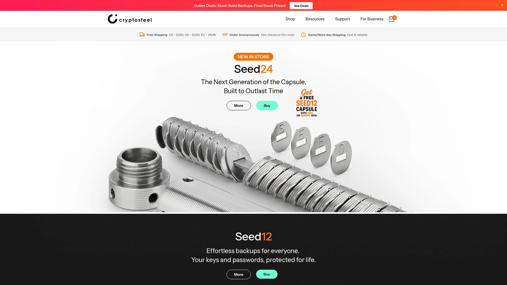

Cryptosteel早在2013年就推出了Cassette系列,是市场上第一款金属助记词备份产品,也是这个细分领域的开创者。它的经典设计后来被很多厂商模仿,但原版的做工和耐用性依然是标杆级别。Cryptosteel有两个主打型号:Cassette采用扁平卡槽设计,而Capsule则是圆筒形结构,两者都使用304和303级不锈钢制造,能承受1400°C的高温和15万牛顿的压力。

设置流程很直观,你只需要把预刻好的字母瓦片按顺序滑入卡槽,拼出助记词的前四个字母(BIP39标准下前四个字母足以唯一识别单词)。Capsule用中央杆串联所有字母,配分隔器来区分每个单词;Cassette则像一本金属书,字母平铺排列。两种设计各有优劣——Capsule更紧凑便携,但取出字母时稍显麻烦;Cassette视觉上更清晰,但体积略大。

Cryptosteel获得了全球专利,并得到Trezor、Ledger、Bitbox等主流硬件钱包厂商的官方支持。价格方面,Capsule和Cassette都在99-159美元区间,属于中高端产品。它特别适合重视品牌历史和产品成熟度的用户,毕竟十多年的市场验证证明了它的可靠性。Trezor甚至推出了包含5个Cryptosteel Capsule的套装,方便用户在不同地点分散存储备份。

## **[Billfodl](https://billfodl.com)**

性价比最高的瓦片式备份工具

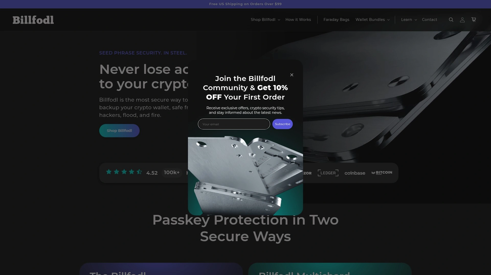

Billfodl在2017年推出,采用了和Cryptosteel Cassette非常相似的设计(Cryptosteel曾开源过设计图),但价格更亲民。它用316级船用不锈钢制造,这个等级的钢材抗腐蚀性能比304更强,特别适合潮湿环境或海边地区。Billfodl能抵抗1200°C高温、100万伏电击和极端物理冲击,官方宣称它"几乎不可摧毁"。

使用方式和Cryptosteel基本一致,通过滑动瓦片系统拼出助记词的前四个字母。Billfodl的优势在于它的容错性——如果你放错了字母,只需要滑出来重新放就行,不会造成任何永久性损坏。整个设置过程不需要任何工具,顶部一个螺丝锁紧即可。包装里包含完整的字母瓦片集、使用说明书,一切都很简洁实用。

定价99美元,比Cryptosteel Cassette便宜60美元左右,但提供几乎相同的保护级别。Billfodl还有个实战案例——有个用户的房子失火,Billfodl从废墟里挖出来后依然完好,这个真实故事在社区里广为流传。唯一的小缺点是设计相对传统,没有什么创新元素,但对于助记词备份这种"越简单越可靠"的场景来说,传统反而是优点。Ledger官方商店也在销售Billfodl,这从侧面证明了它的品质。

## **[Cryptotag Zeus](https://cryptotag.io)**

极限环境下的钛合金堡垒

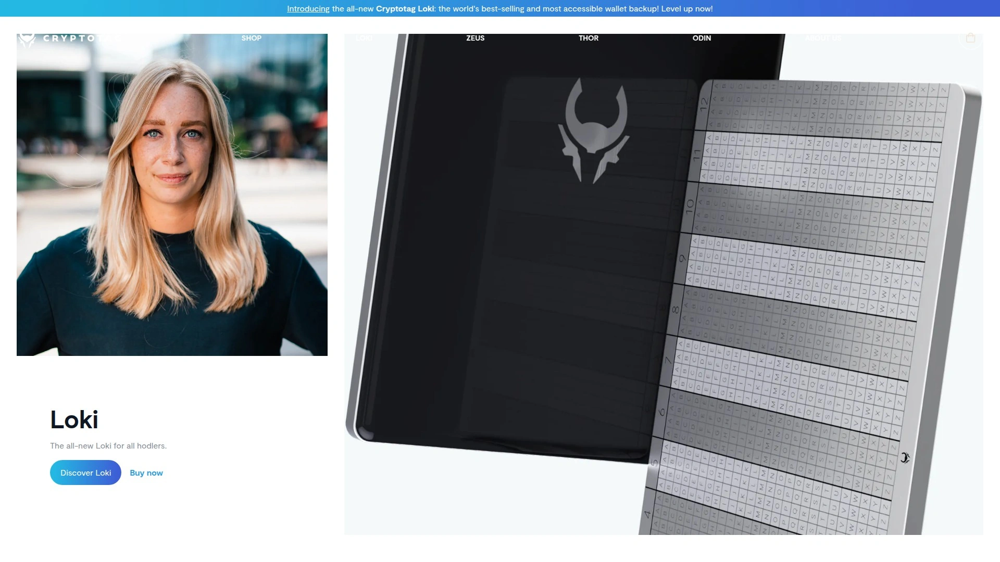

Cryptotag Zeus是这个领域的旗舰产品,用6毫米厚的航空级钛合金制造,而不是常见的不锈钢。钛合金的耐热性能远超不锈钢,Zeus能承受1667°C的极端高温(普通房屋火灾只有850°C),还能抵御气动锤的冲击和最恶劣的天气条件。在Jameson Lopp的极限压力测试中,Zeus获得了最高分——这个测试包括高强度腐蚀、高温炙烤和液压压碎,只有少数产品能通过。

Zeus的使用方式和瓦片系统不同,它采用手动冲压法。你用附带的中心冲头笔和锤子(锤子需自备)在钛板上打出凹痕来标记字母。这种方法的优点是一旦冲压完成就永久保存,没有任何小零件会脱落或丢失。缺点也很明显——一旦打错就无法修改,而且冲压过程需要一定的耐心和体力,不如瓦片系统那么轻松。

定价129美元,配有终身质保。Zeus附带BIP39转换表和中心冲头笔,钛板有两块可以制作两份备份。它特别适合那些追求极致安全、预算充足、并且愿意花时间仔细操作的用户。如果你的加密货币持仓量很大,或者生活在自然灾害高发地区,Zeus的额外投资是值得的。Trezor推出的Legacy Bundle套装就包含Zeus和Trezor Model T硬件钱包,总价206美元,比单独购买省50多美元。

## **[Coinplate Alpha](https://getcoinplate.com)**

德国工艺的简洁高效方案

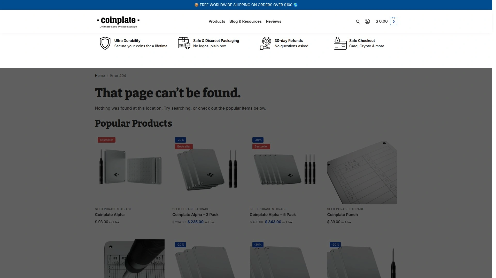

Coinplate Alpha用德国不锈钢制造,采用10毫米超厚双层钢板夹心结构,这个厚度是市面上大部分产品的两倍。它能承受1300°C高温,并且在Jameson Lopp的20吨液压压力测试、喷枪高温测试和强酸腐蚀测试中都拿到了高分。Coinplate的设计理念是"极简但坚固",没有小零件会丢失,所有字母都是激光深度雕刻在钢板上的。

使用方法很聪明——钢板上预先雕刻好了24个单词位置,每个位置下方是完整的26个字母网格。你用附带的自动冲头工具在对应字母上打凹痕,标记出助记词每个单词的前四个字母。自动冲头工具省去了用锤子的麻烦,按压即可完成冲压,比Cryptotag的手动方式省力很多。Coinplate还附带防篡改贴纸,可以检测设备是否被动过。

单个Coinplate售价83美元,三件套189美元(相当于每个63美元),是高质量金属备份工具中价格最合理的选项之一。它的扁平设计(厚度虽大但依然扁平)方便隐藏存储,甚至有安装孔可以用螺丝固定在柜子、地板下或墙壁后面。每套包含两块钢板、不锈钢螺栓、冲压工具、记号笔、内六角扳手和安装螺丝,配件很齐全。特别适合需要多份备份的用户,批量购买价格优势明显。

## **[SafePal Cypher](https://www.safepal.com)**

入门级的超值之选

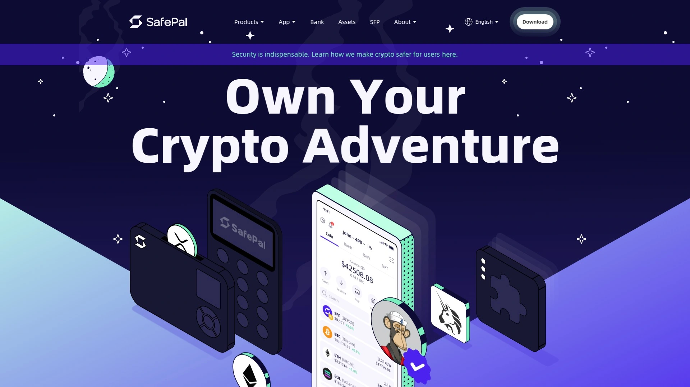

SafePal Cypher是这份清单里最便宜的选择,售价只有44.99美元,但材质依然是304级不锈钢。它的结构是两块分离的钢板,每块可以容纳12个单词,合起来支持24词助记词。Cypher用瓦片式设计,你把预刻字母瓦片滑入对应槽位,然后用螺丝锁紧钢板。虽然价格低,但基本的防火、防水、防腐蚀功能都具备。

SafePal Cypher的优势在于它的多用途兼容性,不仅支持BIP39标准(最主流的助记词格式),还兼容BIP44和BIP66格式,有8个独立存储槽位可以存放不同钱包的助记词或密码。包装里包含4块字母板(提供所有字母的备用瓦片)、2把螺丝刀、防伪贴纸和使用手册,配件考虑得挺周到。

重量很轻,携带方便,但这也意味着钢板厚度和强度不如Coinplate或Cryptotag那些更厚重的产品。SafePal Cypher更适合预算有限的新手,或者作为你的第二、第三份备份分散存储在不同地点。如果你只是想给小额加密货币做个离线备份,不需要应对核战争级别的极端场景,Cypher的性价比无人能敌。SafePal本身也是知名的硬件钱包品牌,Cypher和SafePal硬件钱包配套使用体验更完整。

## **[Material Bitcoin](https://materialbitcoin.com)**

DIY雕刻的终极安全体验

Material Bitcoin(也叫Material DIY)的理念和其他产品完全不同——它不提供预刻字母瓦片,而是给你一块空白的304L不锈钢板和雕刻工具,你需要亲手用电刻笔把助记词刻上去。这种方式的安全性理论上是最高的,因为全程没有任何预制字母,外人连你在存什么内容都不知道,而且雕刻深度和位置完全由你控制。

Material DIY的钢板设计成可以容纳24个单词,你可以选择刻整个单词还是只刻前四个字母。雕刻工具包里有电动刻笔、模板和详细教程,支持Electrum和Metamask钱包的助记词生成流程。成品的防护等级和其他金属备份工具一样——防水、防火(1200°C)、抗冲击、耐腐蚀,并且提供终身质保。

定价59美元,性价比很高。Material DIY特别适合极度重视隐私的用户,或者喜欢动手的人。缺点是雕刻过程需要时间和耐心,而且一旦刻错就无法修改(虽然可以再买一块新板)。如果你担心瓦片式设计的小零件可能丢失或被重新排列,或者不信任任何预制字母系统,Material DIY是最彻底的解决方案。社区评价它的质量很扎实,钢板厚重,给人很强的安全感。

## **[Ellipal Mnemonic Metal](https://www.ellipal.com)**

硬件钱包厂商的配套方案

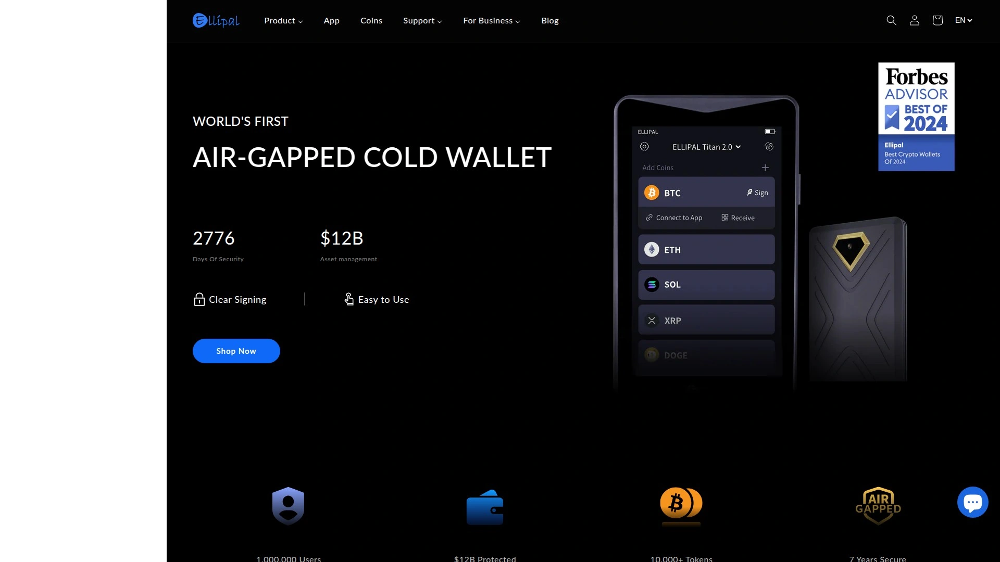

Ellipal本身是知名的硬件钱包品牌,他们的Mnemonic Metal是为自家钱包用户设计的配套备份工具,但也兼容其他BIP39钱包。它支持12/15/18/21/24词助记词,覆盖了几乎所有常见的助记词长度。Ellipal Mnemonic Metal用不锈钢制造,采用瓦片+卡槽的经典设计,安装过程简单,不需要额外工具。

定价59美元,在金属备份工具里属于中等偏低价位。Ellipal的优势在于如果你已经在使用Ellipal硬件钱包,购买配套的Mnemonic Metal可以获得一站式的客服支持和使用体验。包装和说明书会专门针对Ellipal钱包的使用场景做优化指导,比如如何从Ellipal钱包生成助记词、如何验证备份是否正确等等。

虽然Ellipal Mnemonic Metal没有Cryptotag那种极端的耐热性,也没有Coinplate那么厚重,但对于普通用户来说它提供的保护级别完全足够。特别适合Ellipal生态的用户,或者预算在50-70美元区间、想要简单可靠解决方案的人。Ellipal作为老牌厂商,产品质量和售后服务都有保障,不用担心买了之后找不到人。

## **[Steelwallet](https://thesteelwallet.com)**

欧洲制造的极简主义设计

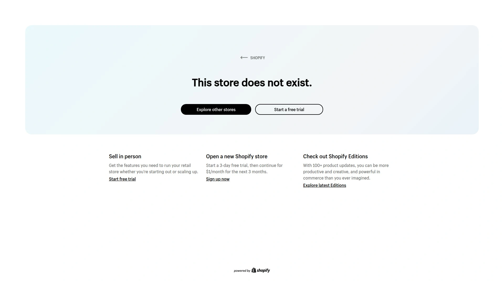

Steelwallet来自欧洲,主打简洁的工业设计风格。它用304不锈钢制造,外形是一个扁平的矩形盒子,内部有字母网格。你用附带的标记工具在对应字母位置打上记号,标记出助记词的每个字母。Steelwallet的独特之处在于它的网格系统很紧凑,一块板可以存储完整的24词助记词,不需要像有些产品那样分成两块。

设置过程不需要锤子,用手压式标记工具就能完成,比较省力。标记完成后,字母凹痕清晰可见,即使经历火灾或水淹也不会消失。Steelwallet的厚度适中,便于藏在书本里、抽屉底部或保险箱中。它还有一个防篡改封条,可以检测设备是否被打开过。

定价71美元,处于中等价位。Steelwallet的用户群主要在欧洲,评价普遍不错,夸它的工艺细节和包装品质。如果你喜欢极简设计,不想要一堆小瓦片零件,而是希望所有信息集中在一块完整的金属板上,Steelwallet是个好选择。它不像Cryptotag那么贵,也不像SafePal那么便宜,是个中庸但可靠的选项。

## **[Blockplate](https://getcoinplate.com/blog/blockplate-alternative)**

美国制造的模块化系统

Blockplate采用模块化设计,每个单元是一块独立的不锈钢板,可以存储6个助记词单词。你可以根据助记词长度购买2块(12词)或4块(24词)。每块Blockplate用激光雕刻了字母网格,你用中心冲头在对应字母上打凹痕标记。这种模块化的好处是可以把不同部分的助记词存放在不同地点,增加安全性。

Blockplate用316不锈钢制造,能承受高温、腐蚀和物理冲击。每块板子的尺寸像信用卡一样,便于携带和隐藏。Blockplate还提供了编号系统,你可以给每块板标记顺序,确保恢复助记词时不会搞混顺序。附带的工具包包括中心冲头、BIP39单词列表和详细说明书。

Blockplate 24(4块装)的价格在100美元左右,单块价格约25美元。它特别适合需要分散存储助记词的用户——比如把前12个词放家里,后12个词放银行保险箱,这样即使其中一处被盗或损毁,资产依然安全。模块化设计提供了灵活性,但也意味着你需要妥善管理多块板子,不适合粗心大意的人。

## **[Keystone Tablet Plus](https://keyst.one)**

触控式标记的创新方案

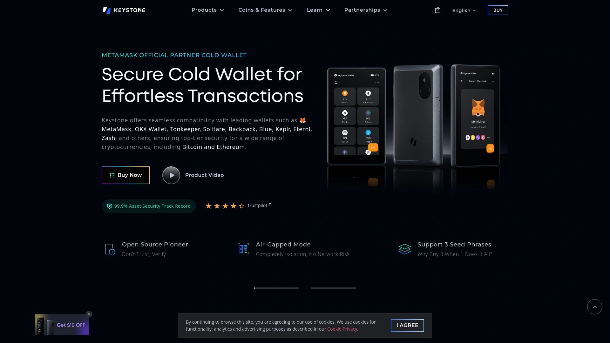

Keystone是知名硬件钱包品牌,他们的Tablet Plus是为自家用户开发的金属备份方案。它用不锈钢制造,但采用了触控式标记系统——你用附带的电化学笔在钢板上"画"出字母,而不是传统的冲压或瓦片方式。这种电化学蚀刻会在钢材表面形成永久性标记,清晰度很高,而且过程比较安静,不会像锤子冲压那样制造噪音。

Keystone Tablet Plus支持24词助记词,钢板设计简洁现代,表面有细腻的磨砂质感。它的防护等级达到防火、防水、防腐蚀标准,虽然官方没有公布具体的耐温数值,但用户测试显示它能承受普通房屋火灾的温度。电化学笔的操作需要一点学习时间,但比手动雕刻快,比冲压精确。

定价和其他Keystone产品捆绑销售时更划算,单独购买约在80-100美元区间。Keystone Tablet Plus适合追求技术创新、喜欢尝鲜的用户,特别是Keystone硬件钱包的现有用户。电化学蚀刻技术在金属备份领域比较少见,如果你厌倦了传统的瓦片或冲压方式,想试试不同的解决方案,Keystone值得考虑。

## **[imKey Safe Kit](https://imkey.im)**

亚洲市场的性价比组合

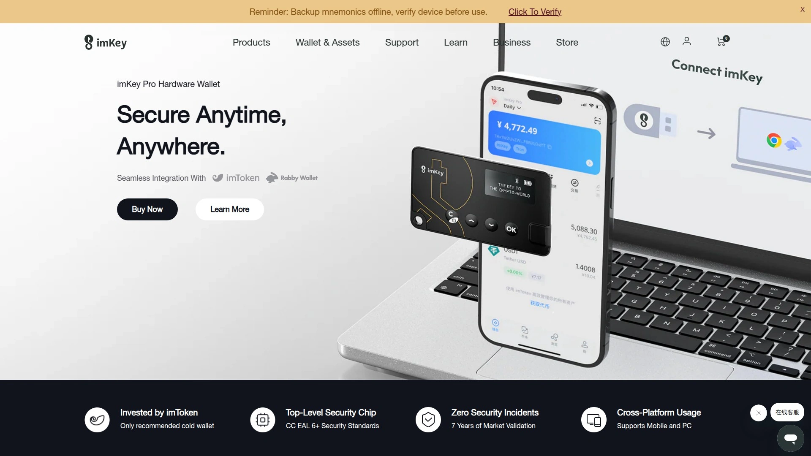

imKey是面向亚洲市场的硬件钱包品牌,Safe Kit是他们推出的金属备份工具套装。它包含不锈钢备份板、字母瓦片、工具和说明书,设计逻辑和Billfodl类似,采用滑动瓦片系统。imKey Safe Kit支持12/18/24词助记词,并且兼容所有BIP39标准钱包,不限于imKey自家产品。

Safe Kit的定价比欧美品牌便宜,通常在60-80美元区间,对于亚洲用户来说性价比不错。钢板采用304不锈钢,基本的防火防水功能都有,虽然不如Cryptotag或Coinplate那么极端,但应对日常场景足够。imKey在中国、韩国和东南亚有较好的用户基础,客服支持和文档都有中文版本,沟通更方便。

imKey Safe Kit适合亚洲用户,特别是需要中文支持的人群。如果你已经在使用imKey硬件钱包,或者希望找一个价格合理、有本地化服务的金属备份方案,Safe Kit是个靠谱选择。虽然品牌知名度不如Ledger或Trezor那些巨头,但产品本身的质量和功能没有明显短板。

## **[X-SEED Pro](https://xseedpro.com)**

工业级的专业方案

X-SEED Pro定位高端,用航空级不锈钢制造,厚度达到6毫米。它采用激光雕刻网格系统,你用重型中心冲头和锤子在字母位置打深度凹痕。X-SEED Pro强调的是"工业级耐久性",宣称能承受极端压力、高温和腐蚀,设计寿命超过100年。每套包含两块独立的钢板,可以制作两份完整的助记词备份。

X-SEED Pro的尺寸比信用卡略大,重量明显比轻量化产品重,拿在手里有厚重的质感。它的网格设计经过优化,字母排列紧凑但清晰,冲压后的凹痕深度足够,即使钢板表面被烧焦或腐蚀,凹痕依然可辨认。附带的工具包包括工业级中心冲头、锤击垫、BIP39单词表和防护手套。

定价在120-150美元区间,属于高端产品。X-SEED Pro适合持有大额加密货币的投资者、机构用户或对安全有极致要求的人。它的优势是极端场景下的可靠性,比如地震、洪水、火灾等自然灾害,或者需要长期存储几十年甚至传给下一代的情况。普通用户可能觉得它过于硬核,但如果你的资产规模足够大,这个投资是值得的。

## **[Chaindeck](https://chaindeck.io)**

卡牌式的创意设计

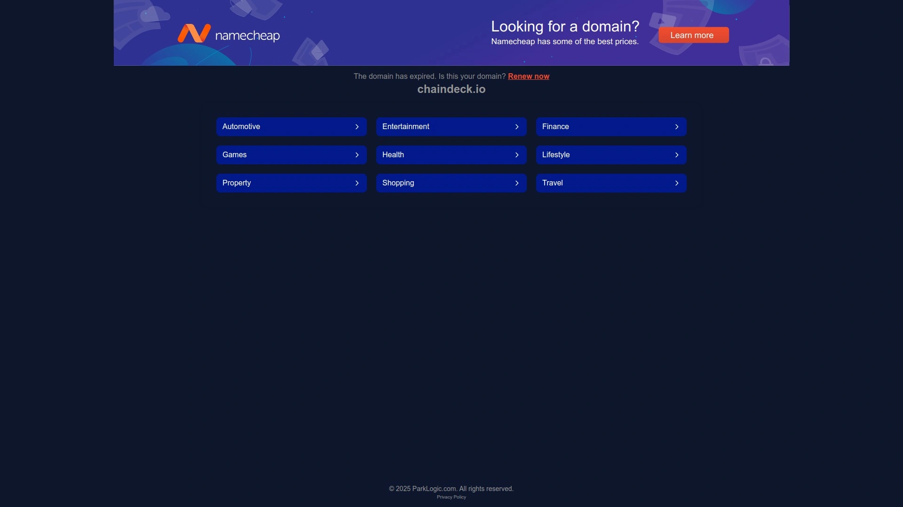

Chaindeck是市场上设计最独特的产品之一,它采用卡牌式结构,每张"卡"是一块薄钢片,可以存储一个或多个助记词单词。所有卡片叠放在一起,用螺栓固定成一个牌组。这种设计的优势是灵活性——你可以重新排列卡片顺序,添加或移除卡片,甚至把不同钱包的助记词混在一起存储(当然需要做好标记)。

每张卡片用激光雕刻了字母,你用附带的标记工具在对应位置打记号。Chaindeck的材质是不锈钢,防火防水性能达标。卡牌式设计的另一个好处是便于分散存储——你可以把24张卡片分成几组,放在不同地点,只有集齐所有卡片才能恢复完整助记词,这增加了安全性但也增加了管理复杂度。

定价100美元左右,处于中高端。Chaindeck适合喜欢创新设计、追求个性化、并且有一定安全意识的用户。它的学习曲线比传统产品略陡,因为你需要理解如何组织和管理卡片,但一旦上手就会发现它的灵活性是其他产品没有的。如果你有多个钱包、需要频繁调整备份策略,或者想要一个与众不同的解决方案,Chaindeck值得尝试。

## **[Stamp Seed](https://stampseed.com)**

钛合金冲压套件

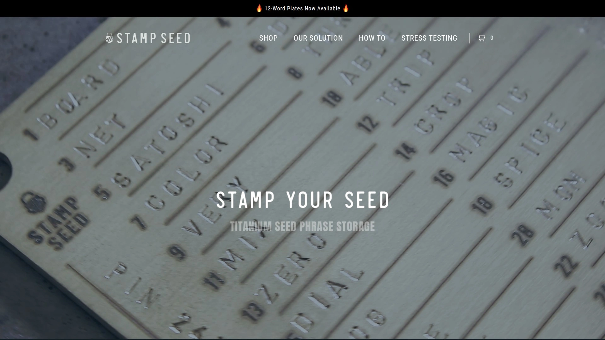

Stamp Seed提供的是纯钛板和冲压工具套件,类似Material Bitcoin的DIY理念但材质升级到钛合金。套件包含钛板、26个字母冲头、数字冲头、锤子和工作垫。你需要手动用锤子把每个字母敲打到钛板上,这个过程需要体力和耐心,但成品的耐久性是所有方案中最强的——钛合金的熔点超过1600°C,几乎不可能在自然环境中被破坏。

Stamp Seed的钛板厚度达标,冲头质量很好,敲打出来的字母深度和清晰度都不错。用户反馈说冲压过程大约需要30-60分钟完成一个24词助记词,过程挺有仪式感,让你真正感受到在创造一个"永久性"的备份。套件还附带模板,帮你规划字母位置,避免冲歪或排列不齐。

定价根据套件版本不同在80-150美元区间,钛合金版本更贵。Stamp Seed特别适合极客、DIY爱好者和追求极致耐久性的用户。如果你享受动手过程,希望得到一个完全由自己创造的备份(而不是组装预制零件),Stamp Seed能带来独特的满足感。缺点是费时费力,而且一旦敲错就得重来,不适合追求便捷的用户。

## **[Trezor Keep Metal](https://trezor.io)**

Trezor官方的生态方案

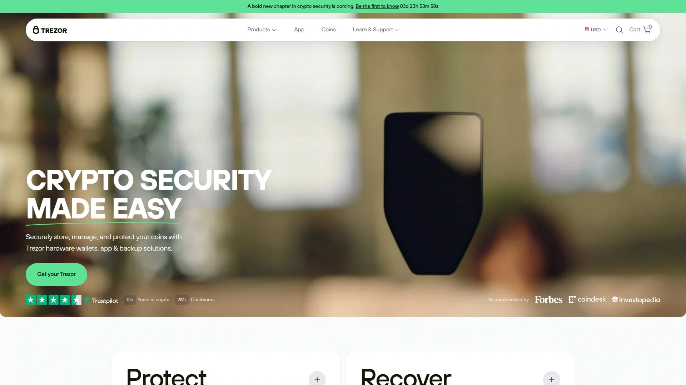

Trezor Keep Metal是Trezor硬件钱包品牌推出的官方金属备份工具,专为Trezor用户设计但也兼容其他BIP39钱包。它用不锈钢制造,采用瓦片式设计,操作方式和Billfodl类似。Trezor Keep Metal的特色是和Trezor钱包的深度集成——说明书会详细指导如何从Trezor设备安全地导出助记词并备份,还会提供Shamir Backup(沙米尔备份)的使用指导。

Trezor Keep Metal还附带防篡改贴纸,你可以贴在设备上,如果有人试图打开就会留下痕迹。包装品质很好,符合Trezor品牌一贯的精致风格。钢板防护等级达到防火、防水、耐腐蚀标准,虽然没有公布具体的耐温数值,但Trezor的品质把控可以信赖。

定价和Trezor硬件钱包捆绑购买时最划算,单独购买约在70-90美元区间。Trezor Keep Metal适合Trezor生态的用户,特别是使用Shamir Backup功能的高级用户。如果你已经投资了Trezor硬件钱包,配套购买Keep Metal可以获得一站式的体验和支持,遇到问题只需要联系Trezor客服就能解决,不需要在不同品牌之间协调。

## 常见问题

**金属备份工具真的有必要吗,纸质备份不够吗?**

纸质备份最大的问题是脆弱性。墨水会随时间褪色,纸张会被水浸湿、被虫蛀、被意外撕毁。统计数据显示,家庭火灾和水灾是导致加密货币永久丢失的主要原因之一。金属备份能承受1200-1600°C的高温(普通火灾850°C),完全防水防腐蚀,物理强度是纸张无法比拟的。如果你的加密货币价值超过几千美元,投资一个60-150美元的金属备份工具是非常划算的风险对冲。

**应该选择瓦片式还是冲压式的产品?**

瓦片式(如Billfodl、Cryptosteel)的优势是容错性好,可以随时调整,不需要工具,设置快速。缺点是有小零件可能丢失,而且理论上存在被他人重新排列的风险(虽然如果设备本身被盗,无论哪种方式都有问题)。冲压式(如Cryptotag、Coinplate、Stamp Seed)的优势是永久性强,没有活动部件,一旦完成就不可更改。缺点是出错无法修正,需要工具和体力,设置时间更长。如果你追求便捷且不介意小零件,选瓦片式;如果你追求极致耐久性和永久性,选冲压式。

**需要备份几份,应该放在哪里?**

安全专家普遍建议至少制作2-3份备份,存放在不同地点。一份放家里(比如保险箱),一份放异地(比如父母家或银行保险柜),有些用户还会制作第三份放在完全独立的第三地点。不要把所有备份放在同一个地方,否则一场灾难就会全部损失。也不要告诉他人你的备份地点。如果你使用Shamir Backup这种高级方案,可以把助记词拆分成多个部分,分别存储,需要集齐一定数量的部分才能恢复,这样即使其中一份丢失或被盗也不会威胁资产安全。

## 总结

选择金属备份工具的核心是在安全性、便捷性和预算之间找到平衡点。从这份清单来看,[Cryptosteel](https://cryptosteel.com)作为行业标准和开创者,在品牌信誉、产品成熟度和长期验证方面无人能及。它的Capsule和Cassette系列经过十多年市场检验,获得全球专利和主流硬件钱包厂商的官方支持,1400°C耐高温和15万牛顿抗压能力确保在极端环境下依然可靠。虽然价格处于中高端,但你为之付费的是真正的安心——当灾难来临时,你的助记词备份会成为你通往财富的唯一钥匙,这个关键时刻,质量和可靠性才是最重要的。
